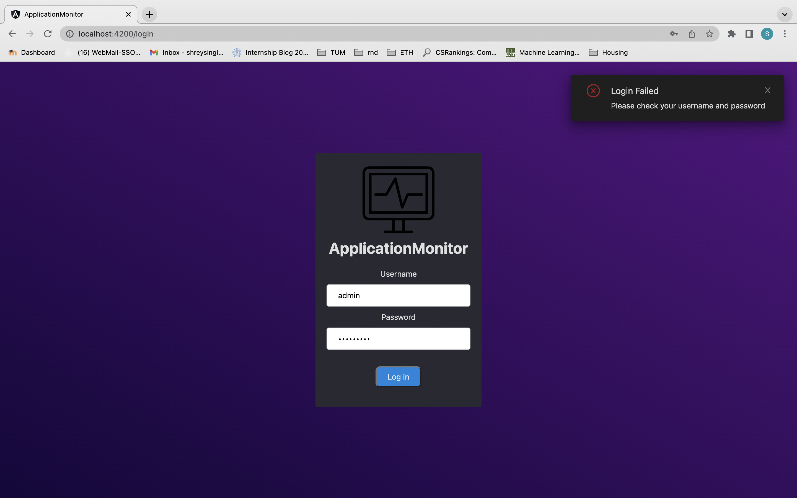
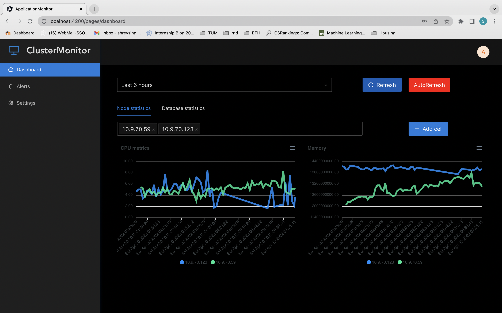
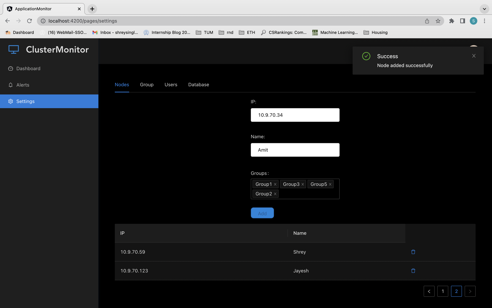
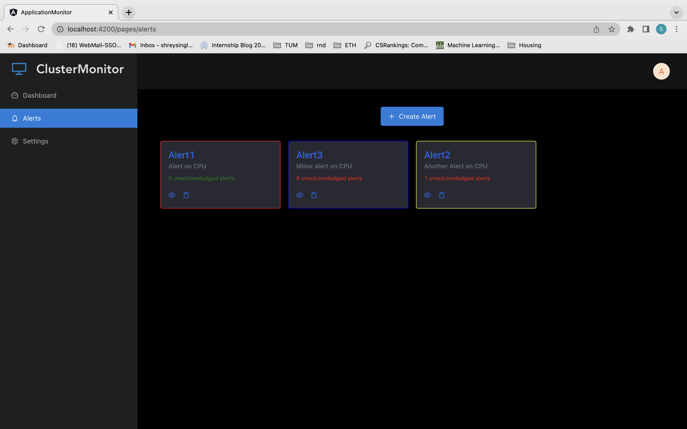

<h1 align="center">Angular - The modern web developer's platform.</h1>

  
   
  <i>ApplicationMonitor is a time series data monitoring platform for databases and systems
      using influxdb, telegraph, Angular and NodeJs</i>
   

This is an application monitor that monitors an application running in parallel over multiple machines. There is a controller machine which runs the InfluxDB application monitor. The client machines sends the data in log format to the application monitor using Telegraf. We then analyze the data in the controller machine using InfluxDB and generate a dashboard for CPU statistics, memory usage, disk usage, postgres. Using the analysis, we can suggest changes to the distribution algorithm of the controller machine to improve performance. 

One might think that this task can be performed by performing a time-series analysis on a simple set of log files. However, not using the rich set of features and optimisations provided by databases will be sub-optimal. Database systems take care of optimisations and data integrity, thereby saving the efforts of programmers, and also reducing the possibility of bugs. 

We have used a time-series database InfluxDB combined with Telegraf to monitor the data streams from respective machines. Telegraf provides a nice API to send data from an application to another, across various machines using plugins. InfluxDB is a good choice as it is optimized for time-series data analysis and can be integrated with Telegraf easily.

This project was generated with [Angular CLI](https://github.com/angular/angular-cli) version 13.2.0.

## Features

 - Login on central node
 - Registeration/deregistration of user by administrator
 - Adding/removing a node to network
 - Adding/deleting a new group
 - Adding/deleting a database by administrator
 - Choice of nodes/databases/metrics to monitor
 - Creation, deletion, display and acknowledgement of alerts 

## Intended Users

 - This project can be used by companies hosting multiple servers. Using our project, they can figure out if load is unbalanced among their servers. It could also predict that certain server is going to throttle in some time which would indicate the companies to redirect the load from this server. It could also analyze the performance of different parts like databases, hard resources such as CPU etc and thus find out the bottleneck which needs to be improved.
 - This could also be used more specifically by database administrators to view database specific statistics and keep track of the database usage by different connections.

## User Interface

### Login page

There is a login page which will allow users to login into the dashboard service of the application monitor. The permissions and login credentials of the user are already set by the admin of the institution (eg. a university, a company, etc).

### Registration page

There is a register page which will allow the user to register for the application. This service is only provided to the admin of the institute. The admin can set the login credentials and passwords for other users (eg. professors, TAs, server manager).

### Selection form 

There is a choice provided to the user to select the machines/nodes which the user intends to monitor. The application monitor then gives a choice to the user to select from the group IDs and databases running in the system. Once the user selects the applications (either groupIDs of processes or database running in the system) he needs to monitor, he will be redirected to the Dashboard of the application.

### Dashboard

There is a choice provided to the user to select the machines/nodes which the user intends to monitor. The application monitor then gives a choice to the user to select from the group IDs and databases running in the system. Once the user selects the applications (either groupIDs of processes or database running in the system) he needs to monitor, he will be redirected to the Dashboard of the application.

 - Node specific stats
 - Process specific stats 

   Dashboard  

     Add new node 
   

   Alerts  

 *see Images folder for more

## Authors
* **Amit Kumar Mallik 19D070007** - [fun-math](https://github.com/fun-math)
* **Bhavnoor Singh Marok 190050027** - [bhavnoormarok](https://github.com/bhavnoormarok)
* **Jayesh Singla 190050053** - [jayeshs999](https://github.com/jayeshs999)
* **Shrey Singla 190050114** - [shreysingla11](https://github.com/shreysingla11)

## References 

 - https://docs.influxdata.com/telegraf/v1.22/
 - https://github.com/influxdata/influxdb
 - https://github.com/angular/angular
